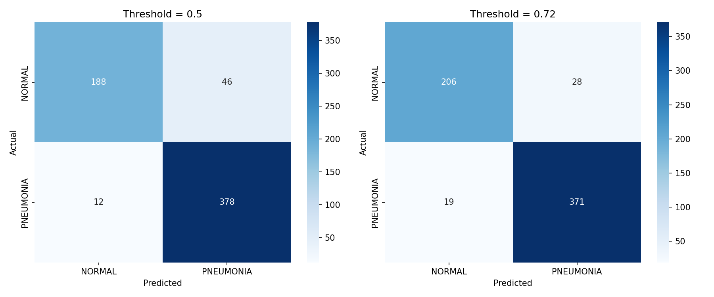
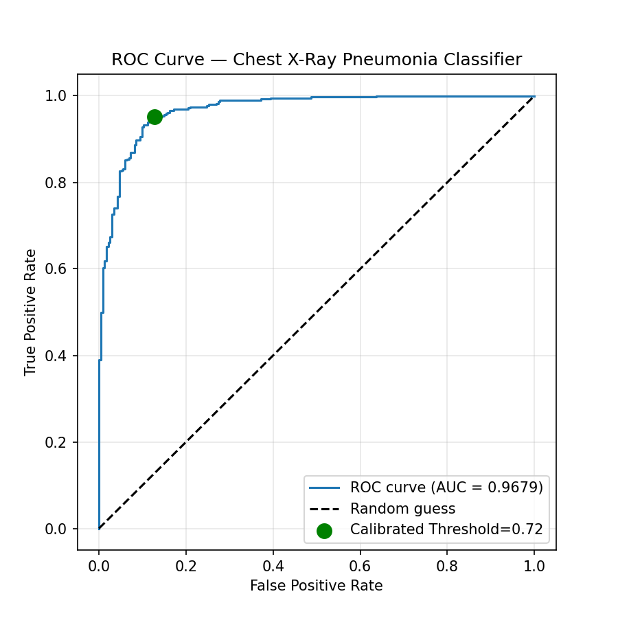
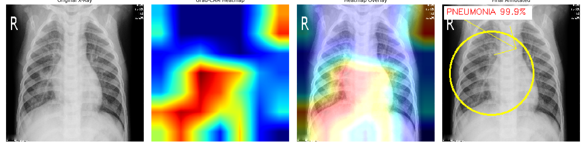

# 🫁 Explainable AI System for Chest X-Ray Pneumonia Detection

An end-to-end deep learning system that detects pneumonia from chest X-rays, explains its decisions visually using Grad-CAM, identifies affected lung laterality, and estimates clinical severity — built as a Final Year Project (FYP) in Computer Science.

## 📌 Overview

This project goes beyond simple binary classification. It builds a complete, robust, and clinically-informed pipeline that:

- Classifies chest X-rays as **NORMAL** or **PNEUMONIA**
- Explains predictions with **Grad-CAM heatmaps** and spatial markers
- Detects **laterality** (Unilateral / Bilateral involvement)
- Estimates **severity** using a RALE-inspired scoring system
- Handles real-world messy inputs: dual-panel images, watermarks, low-resolution scans, pseudocolor X-rays, and invalid (non-medical) images

## 🏗️ Architecture
Raw X-Ray Image
│
▼
┌─────────────────┐
│ OOD Filter │ ← Rejects non-medical images, normalizes pseudocolor X-rays
└─────────────────┘
│
▼
┌─────────────────┐
│ Panel Splitting │ ← Detects & splits dual/stacked X-rays
└─────────────────┘
│
▼
┌─────────────────┐
│ Preprocessing │ ← Letterboxing, CLAHE, artifact removal
└─────────────────┘
│
▼
┌─────────────────┐
│ DenseNet121 │ ← Transfer learning, 2-phase fine-tuning
└─────────────────┘
│
▼
┌─────────────────┐
│ Calibrated │ ← Threshold = 0.72 (statistically optimized)
│ Decision │
└─────────────────┘
│
▼
┌─────────────────┐
│ Grad-CAM XAI │ ← Heatmap + spatial markers
└─────────────────┘
│
▼
┌─────────────────┐
│ Laterality + │ ← Left/Right/Bilateral + RALE-inspired severity
│ Severity │
└─────────────────┘
│
▼
Final Report

## 📊 Key Results

| Metric | Value |
|---|---|
| Dataset | Kaggle Chest X-Ray Pneumonia (5,856 images) |
| Test Set | 624 images (held out, never seen during training) |
| **Final Accuracy** | **92.47%** |
| Precision | 0.9298 |
| Recall (Sensitivity) | 0.9513 |
| ROC-AUC | 0.9679 |
| Calibrated Threshold | 0.72 (confirmed via 3 statistical methods) |
| False Positive Reduction | 39% (46 → 28 cases) |

## 🔬 Methodology Highlights

### 1. Robust Preprocessing
- **Letterboxing** — preserves anatomical proportions
- **CLAHE** — normalizes contrast across different X-ray machines
- **Multi-panel splitting** — automatically detects and separates dual X-rays in one file
- **OOD filtering** — rejects non-medical images while correctly accepting pseudocolor medical scans (via symmetry + texture analysis)

### 2. Transfer Learning
DenseNet121 (ImageNet pretrained) trained in two phases:
- Phase 1: Frozen base, custom classification head only
- Phase 2: Fine-tuned top 30 layers at a low learning rate

### 3. Threshold Calibration
Instead of using the default 0.5 decision boundary, the threshold was calibrated to **0.72** using three independent statistical methods (Precision-Recall F1-maximization, fine-grained threshold sweep, and Youden's Index) — all converging on the same optimal range, reducing false positives by 39%.

### 4. Explainable AI (Grad-CAM)
- Fixed a sigmoid-saturation bug that caused blank heatmaps at high confidence
- Fixed a letterbox-padding artifact that caused spurious activations at image borders
- Dynamic spatial markers sized proportionally to the actual opacity region

### 5. Clinical Reasoning Layer
- **Laterality detection**: 3-tier classification (Unilateral / Predominantly-one-side / Bilateral) accounting for radiological left-right convention
- **RALE-inspired severity scoring**: independent per-lung scoring (0–4 each) combined into a total severity index

## 🧪 Robustness Testing

The system was stress-tested against real-world edge cases:

| Test Case | Result |
|---|---|
| Dual-panel X-ray images | ✅ Correctly split & independently classified |
| Non-medical (out-of-distribution) images | ✅ Correctly rejected |
| Pseudocolor X-rays | ✅ Correctly identified & normalized |
| Low-resolution images | ✅ Prediction remained accurate |
| Watermarked / labeled images | ✅ Prediction remained accurate |

## 🛠️ Tech Stack

- **Python**, **TensorFlow / Keras**
- **DenseNet121** (Transfer Learning)
- **OpenCV** (image preprocessing)
- **Grad-CAM** (custom implementation with saturation & padding fixes)
- **Gradio** (interactive demo interface)
- Google Colab (training & development environment)

## 📁 Project Structure
├── notebooks/ # Main development notebook (Colab)
├── src/ # Modular source code
├── results/ # Confusion matrix, ROC curve, sample outputs
├── docs/ # Architecture diagrams, project report
└── README.md

## 🚀 Live Demo

An interactive Gradio interface is included, allowing users to upload a chest X-ray and receive:
- Prediction with confidence score
- Grad-CAM heatmap visualization
- Laterality and severity assessment
- A downloadable diagnostic report

## ⚠️ Limitations & Future Work

- Currently trained on a single-source pediatric dataset (Kaggle); performance on out-of-distribution hospital data may vary — a known challenge in medical AI ("domain shift")
- **Planned improvement**: incorporating real hospital-sourced X-rays for multi-source training to improve generalization
- RALE-inspired severity scoring is an automated proxy, not a radiologist-validated clinical score

## 👤 Author

**Ujala Kiran**
Final Year Project — BS Computer Science

## 📄 License

This project is for academic purposes.
## 📸 Sample Results

### Confusion Matrix (Before vs After Threshold Calibration)

### ROC Curve

### Grad-CAM Explainability Sample

### Multi-Region Detection (Bilateral Case)
)
